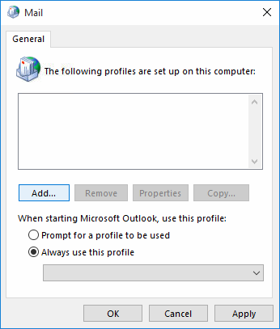
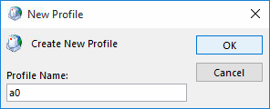
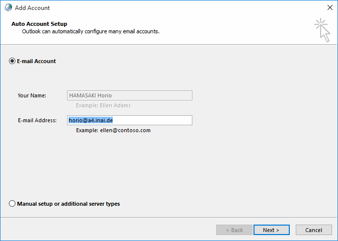
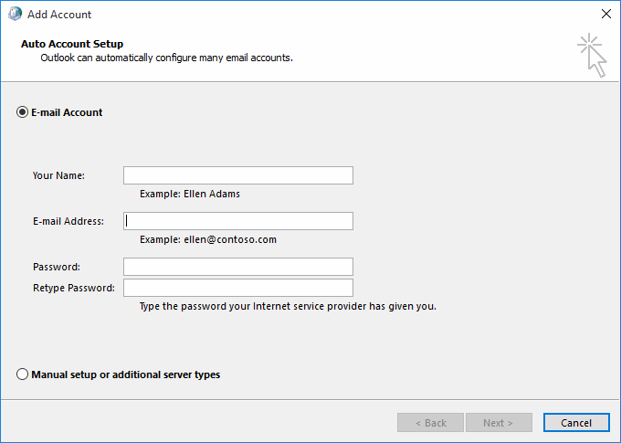
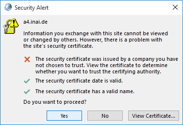
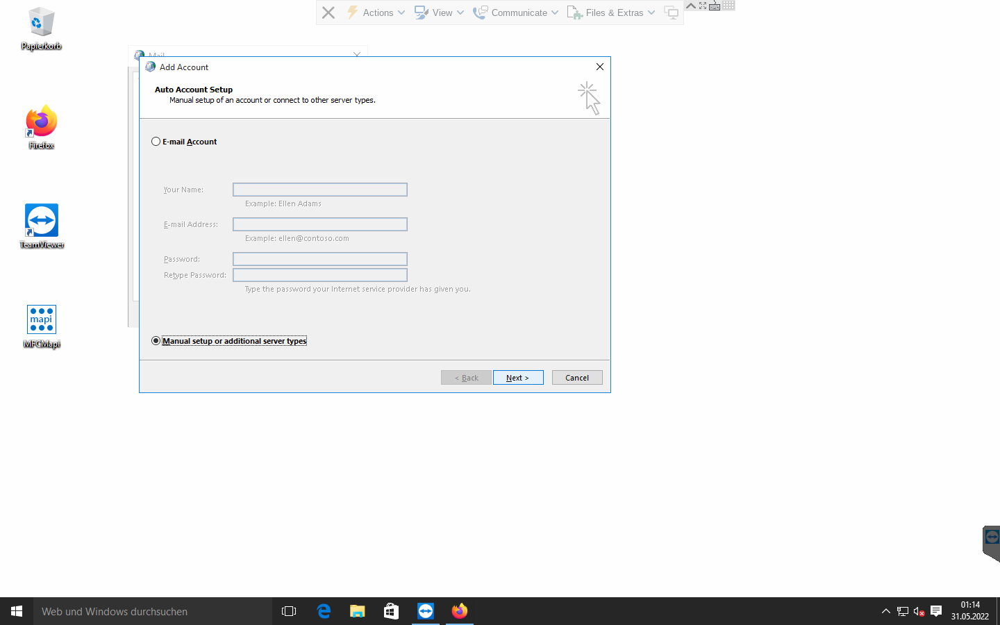
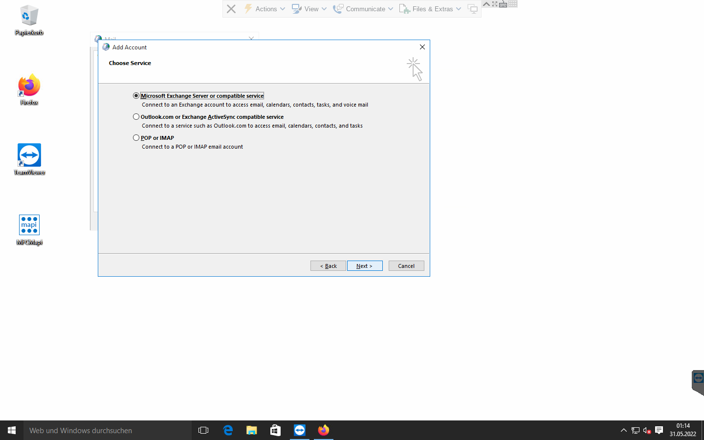
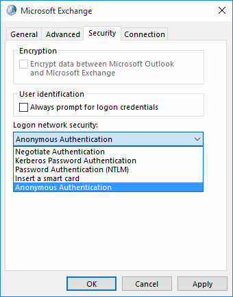
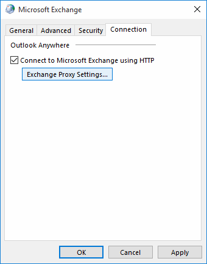
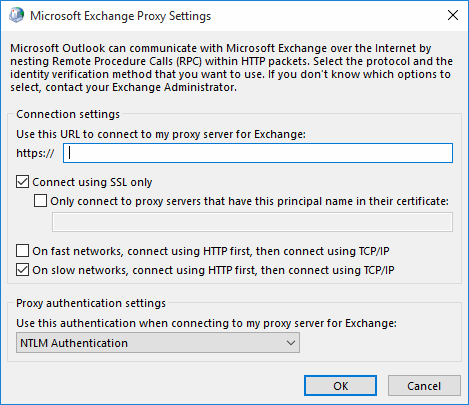

Outlook 2010/2013 setup and the quirks
======================================

Open Control Panel and the E-Mail control widget and create a new profile.
Alternatively, new profiles can be created when launching Outlook if and
when it shows its profile selection dialog (requires that no profile be marked
as default yet).

Special dialog for domain-joined accounts
-----------------------------------------

When creating a new profile in Outlook, you may be presented with a dialog that
has only two fields (name, email address), with the name field being filled in
and grayed out already. This can happen if the computer is joined to an
existing NT/ActiveDirectory domain.

If you were to leave those fields as-is, the wizard might skip AutoDiscover or
use the AutoDiscover of the domain controller (especially when there is already
an Exchange server). We have observed that, in such a domain, the wizard
proceeds and uses the domain controller's name as the RPC server name, thereby
causing requests to never reach the Gromox server.

Modifying the email address field value switches the dialog to present the
usual *four* fields. This action would appear to drop the implied default to
use the domain controller, which is a good thing.

AutoDiscover
------------

When using automatic mode from the 4(!)-field dialog, the profile wizard
proceeds to invoke AutoDiscover. Provided the DNS domain name resolves to a
Gromox server, AutoDiscover should succeed, even if joined to an NT domain of
the same name.

At this point, you may get a warning if you used a self-signed or otherwise not
verifiable TLS certificate. If indeed your Gromox server uses such a
certificate, that is a good sign that AutoDiscover did indeed reach the Gromox
server.

You also have the option to switch to Manual Setup mode with the checkbox in
the lower left of the dialog. We recommend you do this for understanding the
following descriptions. Continue reading below at section "RPC hostname
shenanigans".

Manual Setup
------------

If you choose "Manual Setup", you will skip AutoDiscover. The consequence of
doing so is that you will not get Non-Default Stores (e.g. Shared Mailboxes)
and will not get Public Folders this time around by default. That is to say, if
Outlook does an AutoDiscover request at some later time, the MAPI profile may
still be autoextended by those other stores.

After choosing the Exchange server type radio box, you will proceed to the RPC
detail dialog. You should input the server and user name. The OL2013 profile
wizard defaults to using RPC over port 135, which is not supported by Gromox,
and so using "Check Name" will not function just yet.

.. image:: profrpc.png

Instead, go to "More Settings" and its Security notebook page, and set "Anonymous
Authentication".

Next, goto More Setting's "Connection" notebook page, enter the server name
*again* in the HTTP field, and switch from "NTLM Authentication" to "Basic
Authentication".

You should enable both "On fast networks, connect using HTTP first" and "On
slow networks, connect using HTTP first".

"Connect using HTTP first, then use TCP/IP" is a misnomer; what it really means
"Connecting using RPCHTTP or MAPIHTTP first, then try RPC-over-TCP".

You can close the More Settings subdialog(s).

If you now use the "Check Name" feature, the server and user name field values
should “resolve”, i.e. become underlined. The server name will also change to
an uncanny value of ``SERVERS``.

RPC hostname shenanigans
------------------------

Whether you have done Manual Setup or reached this point through AutoDiscover,
you will notice that the RPC server has been changed to the value ``SERVERS``.
We have no indication where this name comes from — searching prominent Windows
DLLs, including, but not limited to, ``rpcrt4.dll``, turns up no string of the
sort, and it is incredibly hard to do an Internet search for the word because a
common word was reused.

The server and email address are underlined and the "Check Names" button is
grayed out, which normally indicates that the two field values have
(supposedly) been succesfully resolved.

You may finish the profile wizard at this point. Read on for more technical
gore though…

Some Windows installations are fine with ``SERVERS``. Some are not. We do not
know exactly why, but one hypothesis is that some versions try to resolve the
RPC server name ahead of the RPCHTTP proxy name. We *did* observe, with
Wireshark, that name lookups were being done for ``SERVERS`` (NBNS, LLMNR
and/or MDNS packets) are being emitted into the network.

By modifying the server or user name field *again* (e.g. remove last character
and add the character back again), the field values go back to unresolved mode
and the "Check Names" button becomes available again. When that check feature
is used again, the server now magically resolves to a new value in the form of
``xxxxxxxx-xxxx-xxxx-xx-xxxxxxxxxxxx@hostname``. While we know that this is a
endpoint ID for an RPC proxy and we know where it originates from in the source
code, it also does not help to get the mailbox connection going.

Repeatedly editing a field and using Check Names again, the profile wizard
ping-pongs between ``SERVERS`` and the endpoint ID.

To really fix the wrong RPC server name, using MFCMAPI will become necessary.

MAPI profile data model
-----------------------

Inside the MAPI profile (``a1`` in the screenshots) are (at least) two
services, one of which is for the mailbox, and another is for the addressbook.
The EMSMDB service consists of three or four providers, these should correspond
to the private mailbox, the public mailbox (if any), a transport provider (XP),
and the global address book (GAB). The value ``SERVERS`` can be found in the
properties ``PR_TEST_LINE_SPEED`` (0x662B001F), and 0x662A001F.

There is also ``PR_PROFILE_RPC_PROXY_SERVER`` (which contains the
RPCHTTP/MAPIHTTP proxy) and ``PR_PROFILE_UNRESOLVED_SERVER`` (unsure why this
is kept).

The value in the 0x662A001F property correlates with it. Changing this
property in MFCMAPI changes it in the Control Panel dialog.

MFCMAPI shows the property as ``PR_TRANSFER_ENABLED``, but that is not entirely
accurate. Some property IDs are — unfortunately — reused between different
components (e.g. profile vs. mailbox vs. address book), and MFCMAPI just does
not evaluate the context in which it is used, and so prints the wrong name.

The value for ``PR_TEST_LINE_SPEED`` is of no consequence. It is said
to be a special property to make emsmdb.dll always trigger a network request.

Changing ``SERVERS`` to the real host name makes mailbox access possible.

(Later versions of the connector such as from OL2021 do not create
the 0x662A001F property at all anymore.)

Further reading
---------------

The Windows registry normally needs no changes, but for the curious, there are
some options.

* https://docs.microsoft.com/en-us/outlook/troubleshoot/profiles-and-accounts/unexpected-autodiscover-behavior
