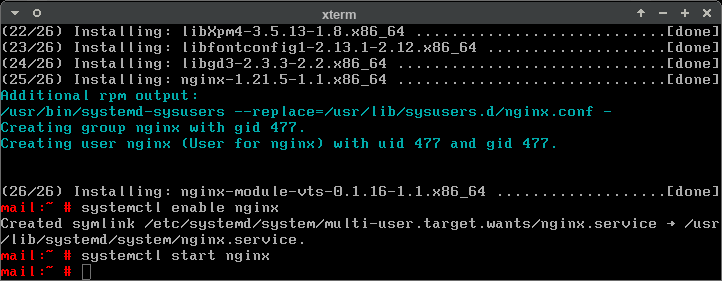

0. Introduction
===============

This document shall show, in a 27-step process, how to install Grommunio
components manually. It is targeted at adept administrators. Pictured above and
subsequently is the typical boot phase of many a contemporary Linux systems.

Pictures in this document depict a (what is initially) a fairly minimalist
openSUSE Tumbleweed container as a base. However, the choice of system used for
the screenshots shall be of no concern. The reader ought to be familiar with
any peculiarities that their particular environment has bestowed upon them, be
it in boot, in package management or configuration of services.

. . . Too complicated? Then use the grommunio Appliance.

0.1. Scale out considerations
=============================

To deploy grommunio over multiple hosts/containers/etc., each host needs to be
populated with a base operating system and the grommunio packages (all, or a
subset).

In case of deployment to a dedicated host (bare metal or virtual machine), the
base OS and packages can be provided by the ISO/OVA appliance images. The
filesystem tree from the RAW image can be used for container environments
(boot-from-directory). Equally though, you can install a base OS of choice
yourself and fill it with the grommunio packages.

YOU decide how you want to split the required resources (CPUs, RAM, disk)
across hosts. You can put all mailboxes and all services on a single monster
machine, or you can create one container for every individual mailbox and every
individual user-facing service. Both extremes are possible, though not
necessarily cost-effective. One big iron machine may cost more to procure than
two irons of half the size. Likewise, running two mailboxes rather than one per
container is more effective because the operating system and processes need not
be replicated that often. However you split it is a determination YOU must
make.

0.2. Components
===============

Services that can be placed on different nodes:

* LDAP/IDM

* MariaDB/MySQL for user metadata

* Mailbox nodes

  * gromox-http/exmdb_provider:

    * Provides a trivial API on port 5000 to serialize SQLite access.

    * Only little state (state which is visible to all consuming service
      at the same time), e.g. search folders.

  * gromox-http:

    * Application server with HTTP on port 10443.

    * Performs user authentication. Connects to MariaDB and optionally LDAP.

    * Provides the handler for AutoDiscover URIs.
      Connects to exmdb to read the mailbox.

    * Provides the handler for MAPI URIs.
      Connects to exmdb to read the mailbox.

    * Keeps the Outlook session state, e.g. object handles.

* PHP nodes

  * gromox-zcore

    * Provides a trivial API on an AF_LOCAL socket

    * Performs user authentication. Connects to MariaDB and optionally LDAP.

    * Keeps the grommunio-web session state, e.g. --

    * Connects to exmdb to read the mailbox.

  * php-fpm: provides a FastCGI API on port 9001

    * runs grommunio-web PHP code

    * connects to gromox-zcore for state and mailbox access

* Frontend HTTP server (possibly as load balancers), e.g. nginx on port 443

  * Proxies to 9001 for URIs belonging to grommunio-web

  * Proxies to 10443 for URIs belonging to OXDISCO, MAPI, RPC

  * Proxies to an uwsgi for URIs belonging to admin-api

  * Serves up flat files (e.g. for grommunio-web/chat/meet/admin-web)

* gromox-midb

  * Caches mailbox data to speed up IMAP access.

  * Provides a trivial API on port 5000 for this IMAP-level meta data

  * Connects to exmdb to read/write the mailbox.

* gromox-imap

  * Performs user authentication. Connects to MariaDB and optionally LDAP.

  * Provides IMAP on port 143.

  * Connects to midb to read/write the mailbox.

* gromox-pop3

  * Performs user authentication. Connects to MariaDB and optionally LDAP.

  * Provides IMAP on port 143.

  * Connects to midb to read/write the mailbox.

* gromox-delivery

  * Mail ingester on port 24.

  * Connects to midb to write metadata.

  * Connects to exmdb to write mailbox.

* postfix or other MTA

  * Optionally performs user authentication (e.g. outgoing mail).
    Connects to MariaDB and optionally LDAP.

  * Provides SMTP on port 25, optionally 587.

  * Connects to gromox-delivery for mail ingesting.

* grommunio-chat

  * Connects to MariaDB and optionally LDAP for authentication.

  * Mattermost application server with HTTP on port 8065.

* grommunio-meet

  * Connects to MariaDB and optionally LDAP for authentication.

  * Prosody application server with XMPP on port 5280.

1. Establish networking
=======================

.. image:: network1.png

For this particular container, I had enabled ``systemd-networkd`` and put the
network configuration in place apriori. If anything, this section is but a
reminder to hook up the host to Internet, as it will be needed to get at
package repositories later. The particular method of network configuration
varies wildly between operating systems, and not every system is using
systemd-networkd. Consult the documentation relevant for your environment to
get online.

.. image:: network2.png

IPv6 is mandatory on the host itself. If you have ``::1`` assigned, all is
good.

You are well advised to install and configure a packet filter, a.k.a. a
firewall, with the sensible default of disallowing every service by default,
save perhaps for a way to let yourself in. More details will be presented
throughout the sections going forward.

2. Declare hostname identity
============================

.. image:: hostname1.png

If you have not consciously set a hostname yet, do so now, especially if some
default setting has left you with localhost as the hostname. You cannot
reasonably reach localhost from another machine without unnecessary pains.

I decided to use ``route27.test`` for the domain part of later e-mail addresses
(e.g. ``someuser@route27.test``), and this particular machine that Grommunio
will be installed on has received a hostname of ``mail.route27.test``.
Arbitrary names can be chosen so long as they make sense for their intended
network.

3. Package manager setup
========================

Visit `<https://download.grommunio.com>`_ to get an idea of the list of platforms for
which pre-built packages have been made available. Even though different
operating systems may use the same archive format (RPM, DEB, etc.) or
repository metadata formats (rpm-md, apt), do not use a repository which does
not exactly match your system. Do not use Debian packages for an Ubuntu system
or vice-versa. Do not use openSUSE packages for a Fedora system or vice-versa.
Do not even remotely think of converting between formats. 

zypp
----

openSUSE uses yum-style ``.repo`` files for declaring repositories. Based on
the Tumbleweed container introduced earlier, one can create a file
``/etc/zypp/repos.d/grommunio.repo`` and populate it like so:

.. image:: repo-1.png

.. code-block::

	[grommunio]
	enabled=1
	autorefresh=1
	baseurl=https://download.grommunio.com/community/openSUSE_Tumbleweed
	type=rpm-md
	keeppackages=0

Retrieve the GPG key and import it into the RPM database to trust it. Then,
optionally, download the repository metadata (if not, it will be done the next
time you install anything).

.. image:: repo-2.png

.. image:: repo-3.png

.. code-block::

	curl https://download.grommunio.com/RPM-GPG-KEY-grommunio >gr.key
	rpm --import gr.key

dnf
---

RHEL uses ``.repo`` files as well, though in another directory. The file to edit
would be ``/etc/yum.repos.d/grommunio.repo``, with contents:

.. code-block::

	[grommunio]
	enabled=1
	autorefresh=1
	baseurl=https://download.grommunio.com/community/EL_8
	type=rpm-md
	keeppackages=0

Import the GPG key likewise, then proceed to use dnf or yum commands to update
at your leisure.

apt
---

For Debian, one is to add into ``/etc/apt/sources.list.d/grommunio.list``:

.. code-block::

	deb [trusted=yes] https://download.grommunio.com/community/Debian_11 Debian_11 main

Then import the GPG key and proceed to use apt commands to update at your
leisure.

.. image:: repodeb-1.png

.. image:: repodeb-2.png

For Ubuntu installations, the ``universe`` repository is required in addition
to the base install.

4. nginx
========

nginx is used as a frontend to handle all HTTP requests, and to forward them to
further individual services. For example, RPC/HTTP requests will be delegated
to Gromox for further processing, Administration API (AAPI for short) requests
will be delegated to an uwsgi instance for further processing, and Mattermost
requests to the chat API.

An alternative HTTP server may be used if you feel comfortable in configuring
all of it, however this guide will only focus on nginx. Now then, source the
nginx package from your operating system, and have the service started both on
next boot and immediately.

.. image:: nginx-1.png

In this screenshot, we also requested the installation of the nginx VTS module,
which AAPI can *optionally* for reporting traffic statistics. VTS is
**not** available for all platforms, in which case you have to omit and make do
without it.

Being the main entrypoint for everything, the nginx HTTPS network service,
generally port 443, will need to be configured in the packet filter to be
accessible.

We will return to TLS certificate installation in a later section.

5. TLS certificates
===================

Self-signed certificate
-----------------------

https://stackoverflow.com/a/10176685

Using Let's Encrypt
-------------------

https://certbot.eff.org/instructions

6. MariaDB
==========

MariaDB/MySQL is used to store the user database amongst a few auxiliary
configuration parameters. If you plan on erecting a multi-host Gromox cluster,
this database is the one that is meant to be globally available to all nodes
that will eventually be running Gromox services.

A preexisting MariaDB server may be used. All the standard tools and
procedures that the world community has developed around SQL are applicable, in
terms of e.g. configuration, backup/restore, and replication.

Assuming though that you are going for a new SQL server instance, source the
MariaDB packages from your operating system, and have the service started
both on next boot and immediately.

After the installation, do create a blank database and user identity for
accessing it.

.. image:: mysql-3.png

.. code-block:: sql

	CREATE DATABASE `grommunio`;
	GRANT ALL ON `grommunio`.* TO 'grommunio'@'localhost' IDENTIFIED BY 'freddledgruntbuggly';

The MariaDB network service is not meant to be open to the public Internet.
Within your private network, it may need to be opened if (and only if) you plan
on using it in a multi-host Grommunio setup, or when your plans about database
replication demand it.

7. Gromox
=========

Gromox is the central groupware server component of grommunio. It provides
the services for Outlook RPC, IMAP/POP3, an LDA for ingestion, and a PHP
module for Z-MAPI.

The package is available by way of the Grommunio repositories. This guide is
subsequently based on such a pre-built Gromox. Experts wishing to build from
source and who have general knowledge on how to do so are referred to the
[https://github.com/grommunio/gromox/doc/install.rst](Gromox installation
documentation) on specific aspects of the build procedure.

.. image:: gromox-1.png

The connection parameters for MariaDB need to be conveyed to Gromox with the
file ``/etc/gromox/mysql_adaptor.cfg``, whose contents could look like this::

	mysql_username=grommunio
	mysql_password=freddledgruntbuggly
	mysql_dbname=grommunio
	schema_upgrade=host:mail.route27.test

The final line about ``schema_upgrade=``, while not a connection parameter in
its own right, declares that this very host will be the authoritative entity
that is allowed to perform database schema upgrades. Having this line is
desirable, because the Gromox default setting is not to perform any schema
upgrades — this is in consideration of possible multi-host Gromox setups.

With Gromox instrumented on the SQL parameters, proceed now with performing the
initial creation of the database tables by issuing the command:

.. code-block::

	gromox-dbop -C

Gromox runs a number of processes and network services. None of them are meant
to be open to the public Internet, because nginx is already that important
point of ingress. The Gromox exmdb service (port 5000/tcp by default) needs to
be reachable from other Gromox nodes in a multi-host grommunio setup for
reasons of internal forwarding to a mailbox's home server.

8. Postfix
==========

Install it.

9. Administration interface
===========================

Install ``grommunio-admin-api``

.. code-block::

	zypper in grommunio-admin-api grommunio-admin-web

Fragments are placed in /usr/share/grommunio-common/...
In the nginx configuration, include this fragment ...

10. Create first user
====================

...

11. Outlook connection
=====================

...

10. grommunio-web frontend
==========================

.. code-block::

	zypper in grommunio-web

(hook up to nginx / gromox pool / ...)
